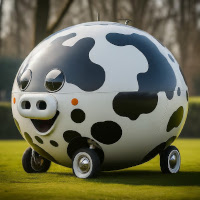

# Spherical Car Racing

You might have heard the term
"[spherical cow](https://en.wikipedia.org/wiki/Spherical_cow)"
or "spherical horse" as a way to simplify a complex concept to illustrate some
point without unnecessary details.

As car racing is one of my passions, I figured why don't we try racing spherical
cars, and learn something along the way?

## Prerequisites

You should have solid beginner-level understanding of Python to be able to program
your "driver". You can try one of the free Python courses, such as
[one](https://www.mathplanet.com/education/programming)
[of](https://www.coursera.org/professional-certificates/google-it-automation)
[these](https://www.udemy.com/course/math-with-python/).

Basic understanding of school level physics is recommended.

Very basic understanding of Git commands such as
[`git clone`](https://docs.github.com/en/repositories/creating-and-managing-repositories/cloning-a-repository)
and
[`git pull`](https://docs.github.com/en/get-started/using-git/getting-changes-from-a-remote-repository)
is required to get the source code and keep it up to date.

It's recommended to
[install the Pillow library](https://pillow.readthedocs.io/en/stable/installation.html)
so that you can get nice graphs to simplify debugging your racers.

Before participating in any race, please make sure you have the latest version
of this repository by running `git pull`. The race setups and descriptions might
get improved/clarified over time, as well as updated in case new records are set.
Some races may also be removed in case they are proved to be incorrect / too ambiguous.

## Race 01

Open [`race_01.py`](race_01.py) and read the comment at the start of the file
for rules and tips on how to proceed.

This is a very simple race, the main purpose here is to let people learn how to
race a spherical car in Python :)

## Race 02

Open [`race_02.py`](race_02.py) and read the comment at the start of the file
for rules and tips on how to proceed.

In this race you might learn something interesting and counter-intuitive.

## Race 03

This is the first 2D race, and it looks like a small autox course.

Open [`race_03.py`](race_03.py) and read the comment at the start of the file
for rules and tips on how to proceed.

The naive solution uses a "karting" line, but the fastest line will be much
more interesting. Once you find the optimal solution, compare the
speed-vs-distance graph of the naive solution with the same graph for the
optimal solution. You will notice that even such a simple 2D spherical car model
requires some "driving techniques" that are typically believed to be needed only
for much more complex 3D effects...

---

Have fun!
